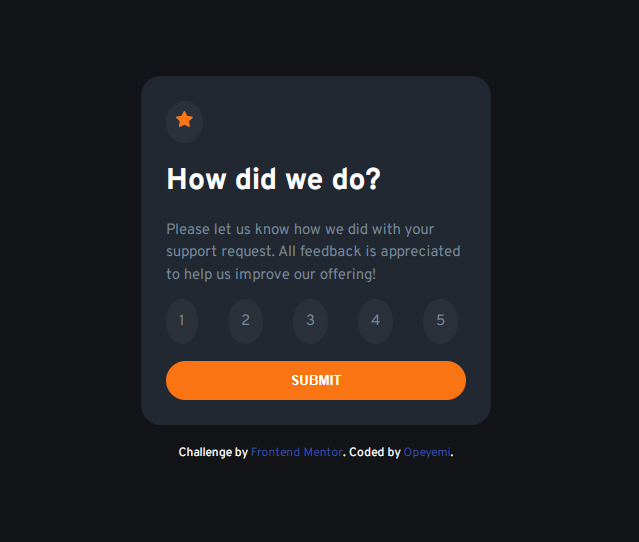
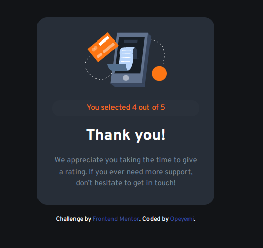

# Frontend Mentor - Interactive rating component solution

This is a solution to the [Interactive rating component challenge on Frontend Mentor](https://www.frontendmentor.io/challenges/interactive-rating-component-koxpeBUmI). Frontend Mentor challenges help you improve your coding skills by building realistic projects. 

## Table of contents

- [Overview](#overview)
  - [The challenge](#the-challenge)
  - [Screenshot](#screenshot)
  - [Links](#links)
  - [Built with](#built-with)
  - [What I learned](#what-i-learned)
- [Author](#author)

## Overview

### The challenge

Users should be able to:

- View the optimal layout for the app depending on their device's screen size
- See hover states for all interactive elements on the page
- Select and submit a number rating
- See the "Thank you" card state after submitting a rating

### Screenshot

### Links

- Solution URL: [https://github.com/opeyemi-code/interactive-rating-component](https://github.com/opeyemi-code/interactive-rating-component)
- Live Site URL: [http://interactive-rating-component-olive-omega.vercel.app/](http://interactive-rating-component-olive-omega.vercel.app/)

### Built with

- Semantic HTML5 markup
- CSS custom properties
- Flexbox
- Mobile-first workflow
- JavaScript

### What I learned

I discovered how to use the forEach method to loop through a list of items and add an event listener to each one. I also learned how to call a specific event listener using the currentTarget event property.

## Author

- Website - https://github.com/opeyemi-code (https://github.com/opeyemi-code)
- Frontend Mentor - @Opeyemi-code
- Twitter - [@opeyemi_obatola](https://www.twitter.com/opeyemi_obatola)
